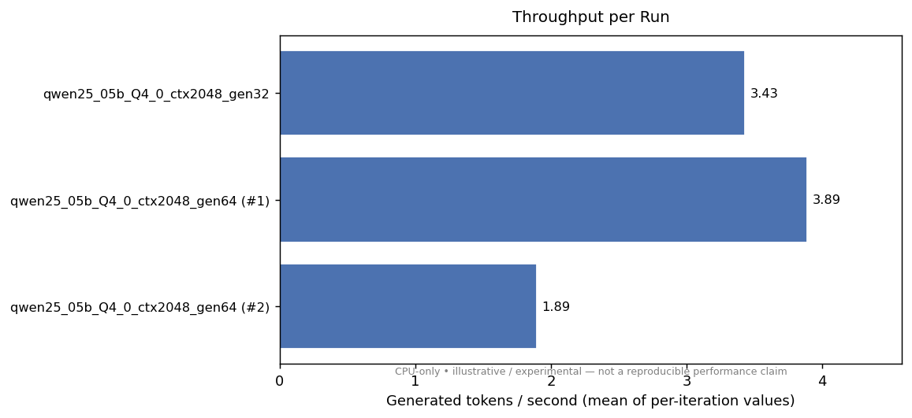
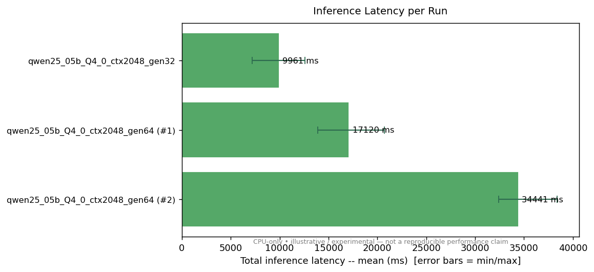
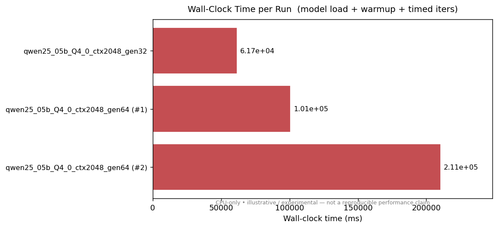

# turboquant-java-runtime

A backend-agnostic Java 17 runtime foundation for future TurboQuant-oriented inference experiments.

---

## Status

> **Pre-alpha / experimental.** The architecture is established and a real end-to-end inference path exists via the `tq-backend-llamacpp` module (llama.cpp, CPU mode). The CPU stub backend also works and all unit tests pass. CUDA and HIP/ROCm backends remain placeholder structures with no real GPU kernels. There is no production-ready implementation. Do not use in production.

---

## Table of contents

- [What this project is](#what-this-project-is)
- [What works today](#what-works-today)
- [What does not exist yet](#what-does-not-exist-yet)
- [Why this project exists](#why-this-project-exists)
- [Architecture overview](#architecture-overview)
- [Project layout](#project-layout)
- [Quick start](#quick-start)
- [Experimental real inference path (llama.cpp)](#experimental-real-inference-path-llamacpp)
- [Benchmark snapshots](#benchmark-snapshots)
- [Native ABI](#native-abi)
- [Roadmap](#roadmap)
- [Notes on TurboQuant](#notes-on-turboquant)
- [Contributing](#contributing)
- [License](#license)

---

## What this project is

`turboquant-java-runtime` is a Java 17 multi-module Maven project that establishes a layered runtime architecture for GPU-accelerated inference experiments. Its central idea is that the Java application layer should remain completely unaware of which GPU vendor — NVIDIA CUDA, AMD HIP/ROCm, or neither — is doing the actual computation.

The project is structured around four layers:

```
Application / Spring Boot
        ↓
  tq-runtime-api      ← stable Java interfaces (Backend, ComputeSession, …)
        ↓
  tq-runtime-core     ← backend selection, lifecycle, ServiceLoader discovery
        ↓
  tq-backend-*        ← cpu-stub / llamacpp / cuda / hip implementations
        ↓
  C ABI (tq_native_api.h) → libtq_cuda.so / libtq_hip.so
  llama.cpp JAR binding  → bundled native libs (de.kherud:llama)
```

`tq-backend-cpu-stub` uses deterministic stub logic — a seeded integer sequence and a simulated KV cache — not real model weights. `tq-backend-llamacpp` loads a local GGUF model file via the `de.kherud:llama` Java binding and runs real text generation. CUDA and HIP backends are placeholder structures only.

---

## What works today

| Feature | State |
|---------|-------|
| Java 17 multi-module Maven build | Working |
| Backend-agnostic public API (`tq-runtime-api`) | Working |
| `ServiceLoader`-based backend discovery | Working |
| `DefaultTurboQuantRuntime` with auto-selection | Working |
| CPU stub backend — deterministic LCG inference | Working |
| KV cache simulation (stub) | Working |
| llama.cpp backend — real GGUF model loading and text generation | Working (CPU mode) |
| Bench CLI (`tq-bench-cli`) — CPU stub and llama.cpp | Working |
| `SessionConfig` with `modelPath`, `maxContextTokens`, `temperature`, `topP` | Working |
| Spring Boot 3 auto-configuration starter | Working |
| Stable C ABI header (`include/tq_native_api.h`) | Working |
| CUDA backend Java class structure + JNI bridge shape | Placeholder |
| HIP/ROCm backend Java class structure + JNI bridge shape | Placeholder |
| Native mock C implementation (`native/cuda/`, `native/hip/`) | Compilable placeholder |
| Unit tests — 63 tests, 0 failures | Passing |

---

## What does not exist yet

- Real CUDA kernels or a working `libtq_cuda.so`
- Real HIP/ROCm kernels or a working `libtq_hip.so`
- Any actual quantization algorithm (TurboQuant or otherwise)
- GPU-offloaded llama.cpp inference (current path is CPU-only)
- Tokenizer integration outside of what llama.cpp handles internally
- Verified performance benchmarks on real GPU hardware
- Production stability, error recovery, or observability
- JPMS (`module-info.java`) descriptors

If you need a production-grade GPU inference runtime, this repository is not there yet.

---

## Why this project exists

Most Java AI inference projects either:
1. Wrap a Python runtime over HTTP (high latency, process boundary), or
2. Use a vendor-specific Java binding (JCuda, etc.) that couples the application to a single GPU vendor.

This project explores a third path: a thin but well-structured Java runtime whose public API is permanently vendor-neutral, and where the GPU-specific code lives entirely in native shared libraries behind a stable C ABI. The expected benefits once mature:

- Switch GPU vendor by dropping in a different `.so` file
- Run the same application code against CPU (for local dev) and GPU (for deployment)
- Integrate with Halo Cloud or similar systems without rewriting the application tier
- Keep Java code reviewable by Java engineers with no CUDA/HIP knowledge

---

## Architecture overview

See [docs/architecture.md](docs/architecture.md) for the full explanation. The short version:

```
┌──────────────────────────────────────────────────────┐
│             Application / Spring Boot                 │
│          (imports only tq-runtime-api types)          │
└───────────────────────┬──────────────────────────────┘
                        │
┌───────────────────────▼──────────────────────────────┐
│                 tq-runtime-core                       │
│    BackendRegistry → ServiceLoader → DefaultRuntime   │
└───────────────────────┬──────────────────────────────┘
                        │  BackendProvider SPI
         ┌──────────────┼──────────────┬──────────────┐
         │              │              │              │
┌────────▼────┐  ┌──────▼──────┐  ┌───▼────┐  ┌─────▼──────┐
│ cpu-stub    │  │ llamacpp    │  │  cuda  │  │   hip      │
│ (pure Java) │  │ (real infer)│  │ (JNI)  │  │ (JNI)      │
└─────────────┘  └──────┬──────┘  └───┬────┘  └─────┬──────┘
                         │             │             │
                  de.kherud:llama  C ABI: tq_native_api.h
                  (bundled .so)   ┌────▼─────────────▼──┐
                                  │libtq_cuda / libtq_hip│
                                  │   (mock / future)    │
                                  └──────────────────────┘
```

**Key properties:**

- `tq-runtime-api` contains zero GPU vendor imports — ever
- Adding a new backend requires no changes to core, API, or SPI
- Porting from CUDA to HIP requires only a new `.so`; no Java changes
- The CPU stub satisfies the full `Backend` + `ComputeSession` contract, so development can proceed entirely without a GPU

---

## Project layout

```
turboquant-java-runtime/
├── pom.xml                        ← parent POM, dependency management
│
├── tq-runtime-api/                ← stable public Java interfaces
│   └── …/runtime/api/
│       ├── Backend.java
│       ├── ComputeSession.java
│       ├── TensorHandle.java
│       ├── TurboQuantRuntime.java
│       ├── InferenceRequest.java
│       ├── InferenceResult.java
│       ├── SessionConfig.java
│       ├── KvCacheStats.java
│       └── …
│
├── tq-runtime-spi/                ← BackendProvider SPI for ServiceLoader
│
├── tq-runtime-core/               ← BackendRegistry, DefaultTurboQuantRuntime
│
├── tq-backend-cpu-stub/           ← working CPU stub (LCG, KV cache sim)
│
├── tq-backend-llamacpp/           ← real inference via de.kherud:llama (CPU mode)
│
├── tq-backend-cuda/               ← placeholder: Java shape + JNI bridge
│
├── tq-backend-hip/                ← placeholder: Java shape + JNI bridge
│
├── tq-bench-cli/                  ← picocli bench harness
│
├── tq-spring-boot-starter/        ← Spring Boot 3 auto-configuration
│
├── include/
│   └── tq_native_api.h            ← shared C ABI header
│
├── native/
│   ├── cuda/                      ← C mock + JNI bridge for CUDA
│   └── hip/                       ← C mock + JNI bridge for HIP
│
└── docs/
    ├── architecture.md
    ├── rocm-porting-plan.md
    ├── llamacpp-demo.md
    └── llamacpp-smoke-test.md
```

---

## Quick start

### Prerequisites

- Java 17+
- Maven 3.8+
- No GPU or native libraries required for the CPU stub path

### Build and run tests

```bash
git clone https://github.com/WaterMelonKnight/turboquant-java-runtime.git
cd turboquant-java-runtime
mvn clean install
```

All 63 unit tests should pass without any native library.

### Run the bench CLI against the CPU stub

```bash
# Build the fat JAR
mvn clean package -pl tq-bench-cli -am

# Basic run — auto-selects cpu-stub
java -jar tq-bench-cli/target/tq-bench-cli-*-fat.jar

# Explicit options
java -jar tq-bench-cli/target/tq-bench-cli-*-fat.jar \
  --backend cpu-stub \
  --warmup 2 \
  --iters 10 \
  --prompt-len 128 \
  --gen-len 32

# List available backends
java -jar tq-bench-cli/target/tq-bench-cli-*-fat.jar --list
```

### Use the runtime in your own Java code

```xml
<!-- Add to your pom.xml -->
<dependency>
  <groupId>com.turboquant</groupId>
  <artifactId>tq-runtime-core</artifactId>
  <version>0.1.0-SNAPSHOT</version>
</dependency>
<dependency>
  <groupId>com.turboquant</groupId>
  <artifactId>tq-backend-cpu-stub</artifactId>
  <version>0.1.0-SNAPSHOT</version>
  <scope>runtime</scope>
</dependency>
```

```java
import com.turboquant.runtime.api.*;
import com.turboquant.runtime.core.DefaultTurboQuantRuntime;

try (TurboQuantRuntime rt = DefaultTurboQuantRuntime.autoSelect(BackendConfig.defaultConfig())) {
    InferenceRequest req = InferenceRequest.syntheticPrompt(128, 32);
    InferenceResult  res = rt.infer(req);
    System.out.println("Backend : " + res.backendName());
    System.out.println("Tokens  : " + res.generatedTokenCount());
    System.out.println("Latency : " + res.inferenceNanos() / 1_000_000 + " ms");
}
```

### Spring Boot integration

```xml
<dependency>
  <groupId>com.turboquant</groupId>
  <artifactId>tq-spring-boot-starter</artifactId>
  <version>0.1.0-SNAPSHOT</version>
</dependency>
```

The starter auto-configures a `TurboQuantRuntime` bean. Provide
`turboquant.backend=cpu-stub` (or omit for auto-selection) in
`application.properties`.

### CUDA path (placeholder — no real kernels yet)

```bash
# Build libtq_cuda.so from the mock C implementation
cd native/cuda
mkdir build && cd build
cmake .. -DCMAKE_BUILD_TYPE=RelWithDebInfo
make -j$(nproc)

# Run against the CUDA mock (CPU-backed, no real GPU needed)
java -Djava.library.path=native/cuda/build \
     -jar tq-bench-cli/target/tq-bench-cli-*-fat.jar \
     --backend cuda
```

> The mock `libtq_cuda.so` uses host memory and a software LCG — it exercises
> the full Java→JNI→C ABI call path, not real GPU computation.

### HIP/ROCm path (placeholder — no real kernels yet)

```bash
cd native/hip
mkdir build && cd build
cmake .. -DCMAKE_BUILD_TYPE=RelWithDebInfo
make -j$(nproc)

java -Dtq.backend.hip.enabled=true \
     -Djava.library.path=native/hip/build \
     -jar tq-bench-cli/target/tq-bench-cli-*-fat.jar \
     --backend hip
```

> HIP is disabled by default to avoid spurious load attempts on CUDA-only hosts.
> Set `-Dtq.backend.hip.enabled=true` to enable.

### llama.cpp path (real inference — CPU mode)

```bash
# Build the fat JAR (includes tq-backend-llamacpp)
mvn clean package -pl tq-bench-cli -am

# Run with a local GGUF model
java -jar tq-bench-cli/target/tq-bench-cli-*-fat.jar \
  --backend llama.cpp \
  --model-path /path/to/model.gguf \
  --prompt "Once upon a time" \
  --max-new-tokens 64 \
  --context 2048 \
  --warmup 1 --iters 5
```

The `de.kherud:llama` JAR bundles native llama.cpp binaries for Linux, macOS, and Windows. No separate installation is required. Current validated mode is **CPU-only**; GPU offload via llama.cpp is not yet wired up in this project.

See [docs/llamacpp-demo.md](docs/llamacpp-demo.md) for the full demo guide, including model download instructions, CLI options, and the optional smoke test.

See [docs/llamacpp-smoke-test.md](docs/llamacpp-smoke-test.md) for model preparation notes and optional smoke test instructions.

---

## Experimental real inference path (llama.cpp)

The `tq-backend-llamacpp` module provides the first real end-to-end inference path in this project. It uses the [`de.kherud:llama`](https://github.com/kherud/java-llama.cpp) Java binding to load a local GGUF model and generate text.

**This is experimental and CPU-only.** It is not optimised, not benchmarked on production hardware, and not intended for production use.

### How it works

1. `LlamaCppBackend.init(SessionConfig)` loads the GGUF model via `LlamaModel(ModelParameters)`.
2. `LlamaCppSession.infer(InferenceRequest)` runs `model.generate(InferenceParameters)`, collecting output tokens into `InferenceResult.generatedText()`.
3. The result is returned through the same `TurboQuantRuntime.infer()` call path used by the CPU stub.

The Java API sees no llama.cpp types — `tq-runtime-api` is still vendor-neutral.

### Smoke run result

The following is a single local benchmark run included to demonstrate that the path works. It is **not** a reproducible performance claim.

```
Environment : Linux x86_64, CPU-only (no GPU offload)
Model       : Qwen2.5-0.5B-Instruct (Q4_0 GGUF)
Context     : 2048 tokens
Max new tok : 32
Warmup      : 2 iterations
Timed iters : 10

Latency (ms):
  mean  :   3559.747 ms
  min   :   3198.628 ms
  p50   :   3499.755 ms
  p99   :   4003.212 ms
  max   :   4003.212 ms
Throughput  :        9.3 tok/s  (generated, CPU-only)
Generated tokens : 33
Backend     : llama.cpp
```

**Observations:**
- llama.cpp loaded successfully; no GPU offload was used or available in the test environment.
- The warning "Not compiled with GPU offload support" from llama.cpp is expected in a CPU-only build.
- Throughput of ~9 tok/s for a 0.5B Q4_0 model on CPU is consistent with llama.cpp reference numbers.
- CUDA and HIP backends in this repository are unrelated to this path — they remain placeholder structures.

---

## Benchmark snapshots

> **Experimental / CPU-only / illustrative.** These numbers come from a single
> development machine running llama.cpp in CPU-only mode. They are included to
> confirm that the end-to-end inference path works and that the benchmark
> tooling produces consistent output. They are **not** reproducible performance
> claims and should not be compared across hardware.

Three runs on Qwen2.5-0.5B-Instruct (Q4\_0, context 2048), CPU-only:

| Run | gen tokens | tok/s (mean) | latency mean | wall clock |
|-----|-----------|-------------|-------------|-----------|
| `gen32` | 32 | 3.428 | 9 960 ms | 61 719 ms |
| `gen64` | 64 | 3.888 | 17 120 ms | 100 868 ms |
| `gen64` (repeat) | 64 | 1.894 | 34 440 ms | 210 514 ms |

Charts (CPU-only, illustrative):





Full table with all columns: [docs/benchmarks/summary.md](docs/benchmarks/summary.md)

### Regenerating charts

```bash
# Requires Python 3 + matplotlib
pip install matplotlib

# From the project root
python scripts/plot_benchmarks.py

# Custom CSV or output directory
python scripts/plot_benchmarks.py \
  --csv benchmarks/results/llamacpp_baselines.csv \
  --out-dir docs/benchmarks
```

The script reads any CSV produced by `tq-bench-cli --output-csv` and writes
`throughput.png`, `latency.png`, `wall_clock.png`, and `summary.md` to the
output directory.

See [docs/benchmarking.md](docs/benchmarking.md) for metric definitions, the
export format, and instructions for adding your own runs.

---

## Native ABI

The file `include/tq_native_api.h` is the portability contract between the
Java JNI bridges and the native backend implementations.

**Design principles:**
- Stable — function signatures never change; new functions are added for new features
- Backend-agnostic — Java sees only opaque 64-bit handles and status codes; no vendor types leak up
- ROCm-portable — CUDA and HIP implementations share the same header; porting is a near-mechanical `s/cuda/hip/g`

**High-level API (added in `TQ_NATIVE_API_MINOR=1`):**

```c
// Runtime lifecycle
tq_status_t tq_runtime_create(int32_t device_index, tq_runtime_t* rt_out);
void        tq_runtime_destroy(tq_runtime_t rt);
tq_status_t tq_runtime_describe(tq_runtime_t rt, char* buf, size_t buf_len);

// Session lifecycle
tq_status_t tq_session_create(tq_runtime_t rt, tq_session_t* session_out);
void        tq_session_destroy(tq_session_t session);

// Inference
tq_status_t tq_session_infer(tq_session_t session,
                              const int32_t* input_token_ids, int32_t input_count,
                              int32_t max_new_tokens, tq_infer_result_t* result_out);
```

See [docs/rocm-porting-plan.md](docs/rocm-porting-plan.md) for the full
ROCm porting checklist.

---

## Roadmap

See [ROADMAP.md](ROADMAP.md) for the versioned plan. In brief:

- **v0.1** (done) — architecture baseline, CPU stub, stable ABI shape
- **v0.2** (in progress) — real inference path: llama.cpp CPU mode working; tokenizer and GPU offload TBD
- **v0.3** — experimental quantization integration
- **Later** — real CUDA kernels, real HIP/ROCm kernels, Kubernetes demo
- **Possible future** — Halo Cloud integration

---

## Notes on TurboQuant

This project is **not** an official TurboQuant implementation and is **not affiliated with Google**.

The name and general direction are inspired by publicly available research on
quantization-oriented inference optimization. No proprietary algorithms,
model weights, or internal Google materials are used or implied. All code
in this repository is independently written.

---

## Contributing

This project is in early pre-alpha. The architecture is still settling.

If you want to contribute:
1. Read [docs/architecture.md](docs/architecture.md) first.
2. Open an issue before starting a large change.
3. The CPU stub path is the safest place to start — it has the most tests and
   requires no native environment.

Native contributions (C/CUDA/HIP) targeting the `native/cuda/` or
`native/hip/` directories are welcome once the Java API stabilises.

---

## License

This project is licensed under the **Apache License, Version 2.0**.
See the [LICENSE](LICENSE) file for the full license text.

```
Copyright 2025 WaterMelonKnight

Licensed under the Apache License, Version 2.0 (the "License");
you may not use this file except in compliance with the License.
You may obtain a copy of the License at

    http://www.apache.org/licenses/LICENSE-2.0

Unless required by applicable law or agreed to in writing, software
distributed under the License is distributed on an "AS IS" BASIS,
WITHOUT WARRANTIES OR CONDITIONS OF ANY KIND, either express or implied.
See the License for the specific language governing permissions and
limitations under the License.
```
